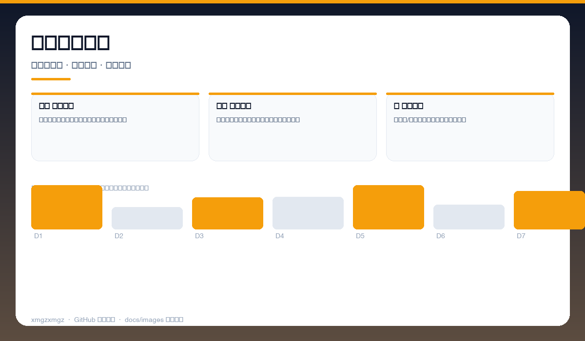
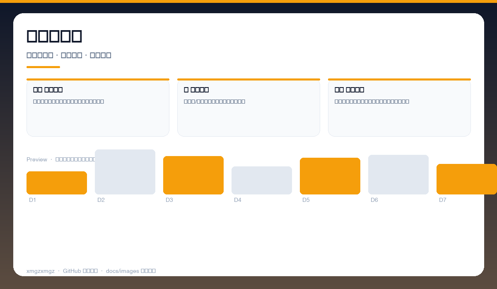
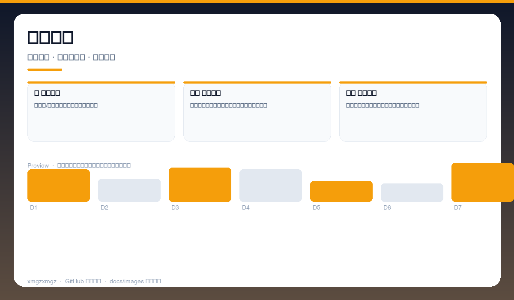

# 📦 Dependency-Analyzer — Dependency-Analyzer

> 给 package.json 做一次 CT 扫描 — 冗余、冲突、循环依赖一图看清。

[](https://github.com/xmgzxmgz/Dependency-Analyzer)
[](https://github.com/xmgzxmgz/Dependency-Analyzer/releases)
[](LICENSE)
[](https://github.com/xmgzxmgz/Dependency-Analyzer/actions/workflows/release.yml)

---

## ✨ 功能一览

| 模块 | 能力 | 状态 |
|------|------|------|
| 🕸️ 依赖图谱 | 交互式图可视化，层级、体积、重复一目了然 | ✅ |
| ⚠️ 冲突检测 | 多版本共存、幽灵依赖、循环依赖自动标注 | ✅ |
| 📉 瘦身建议 | 按体积/使用率排序，给出可移除清单 | ✅ |

---

## 📸 功能预览

> 以下为自动生成的示意预览（无需本地部署截图），展示核心功能形态。

| 总览 | 细节 | 流程 |
|------|------|------|
|  |  |  |
| 依赖图谱总览 · 交互式图谱 · 节点体积 · 依赖层级 | 冲突与冗余 · 多版本冲突 · 幽灵依赖 · 循环高亮 | 瘦身报告 · 体积排行 · 未使用依赖 · 一键优化 |

<details>
<summary>查看大图</summary>


</details>

---

## 🚀 快速开始

```bash
npx dependency-analyzer ./
# 或
npm i -g dependency-analyzer && dependency-analyzer --open
```

---

## 🛠 技术栈

JavaScript · npm · Graph Visualization · AST · Bundle Analysis

---

## 🗂️ 目录结构（节选）

```
Dependency-Analyzer/
├── docs/images/        # 本 README 的三张自动生成预览图
├── .github/workflows/  # Auto Release 自动发版
├── README.md
└── ...                 # 源码与配置
```

---

## 📦 Releases

本仓库已启用 **Auto Release**（`.github/workflows/release.yml`）：

- 推送 `v*` tag 自动发版：`git tag v0.2.0 && git push origin v0.2.0`
- 手动触发：`gh workflow run "Auto Release" -f version=v0.2.0`（留空则自动 patch +1）
- 变更说明自动生成（`--generate-notes`）

前往 [Releases](https://github.com/xmgzxmgz/Dependency-Analyzer/releases) 查看。

---

## 🙏 相关项目

- [workbuddy-account-hub](https://github.com/xmgzxmgz/workbuddy-account-hub) — WorkBuddy 账户中枢（本 README 的样板）
- 更多见 [xmgzxmgz 主页](https://github.com/xmgzxmgz)

---

## 许可

MIT
